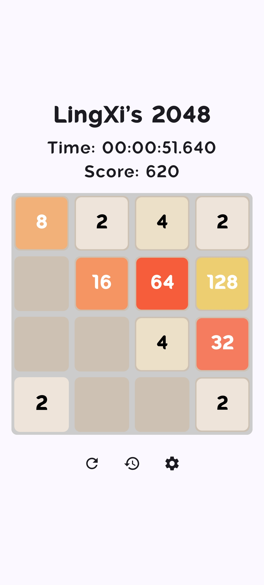
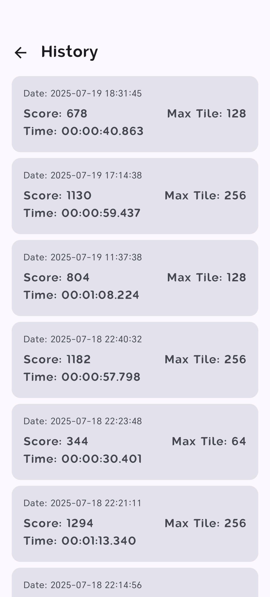
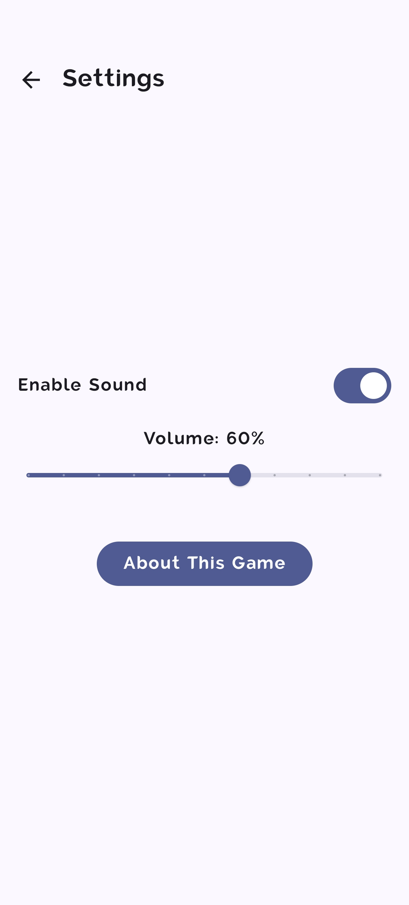

# LingXi's 2048

这是一个基于 Kotlin 和 Jetpack Compose 实现的经典 2048 小游戏。

## ✨ 功能

*   经典的 2048 游戏玩法
*   简洁的 Material Design 3 界面
*   游戏状态（得分、最高分）的保存与恢复
*   ~~撤销上一步操作的功能~~ (Planning)

## 🚀 技术栈

*   **语言:** [Kotlin](https://kotlinlang.org/)
*   **UI 框架:** [Jetpack Compose](https://developer.android.com/jetpack/compose)
*   **架构:** MVVM (Model-View-ViewModel)
*   **构建工具:** [Gradle](https://gradle.org/)

## 🛠️ 构建和运行

1.  **克隆项目**
    ```bash
    git clone https://github.com/LingXi9374/LingXis-2048-game.git
    ```
2.  **在 Android Studio 中打开**
    *   启动 Android Studio
    *   选择 `File` > `Open`
    *   找到并选择克隆下来的项目文件夹

3.  **构建并运行**
    *   等待 Gradle 同步完成
    *   点击 `Run` > `Run 'app'` 按钮，或使用快捷键 `Shift + F10`
    *   选择一个模拟器或连接的物理设备来运行应用

## 📸 截图





## 📄 许可证

该项目使用 GPLv3 许可证。详情请见 `LICENSE` 文件。
